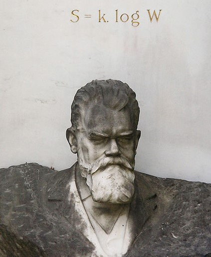

---
#
# By default, content added below the "---" mark will appear in the home page
# between the top bar and the list of recent posts.
# To change the home page layout, edit the _layouts/home.html file.
# See: https://jekyllrb.com/docs/themes/#overriding-theme-defaults
#
#There should be a brief introduction in the future
#This is a picture for Boltzmann's bust and his formula:
#

#
#

title: 
list_title: Blogs
layout: home
---

